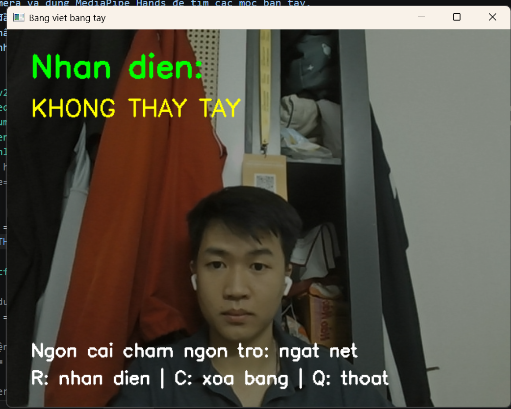

# Air Writing Digit Recognition — Nhận diện chữ số viết trong không khí

[Tiếng Việt](README.md) | [English](README.en.md)

Dùng đầu ngón trỏ để viết một chữ số trước webcam, sau đó nhấn **`r`** để nhận diện chữ số từ **0 đến 9**. Dự án kết hợp **MediaPipe Hands** để theo dõi bàn tay (*hand tracking*), **OpenCV** để thu hình và vẽ trên bảng ảo (*canvas*), cùng mô hình **CNN** chạy bằng **TensorFlow/Keras** để phân loại chữ số.

Đây là dự án thực hành về **Computer Vision** (thị giác máy tính) và **Deep Learning** (học sâu). Mô hình CNN được huấn luyện trên **MNIST**; MediaPipe cung cấp mô hình theo dõi bàn tay có sẵn.

## Demo

[Xem hoặc tải video demo — MP4, khoảng 6 giây](assets/demo.mp4?raw=true)



Ảnh minh họa được chụp khi ứng dụng chưa phát hiện bàn tay. Video thể hiện một ví dụ thao tác, không phải phép đo độ chính xác.

Giao diện hiện dùng tiếng Việt **không dấu** vì font Hershey của `cv2.putText()` không hỗ trợ đầy đủ ký tự tiếng Việt. Tài liệu và chú thích mã nguồn sử dụng tiếng Việt có dấu. Để giao diện có dấu cần bổ sung cách render chữ hỗ trợ Unicode.

## Tính năng

- Theo dõi tối đa một bàn tay bằng MediaPipe Hands.
- Dùng đầu ngón trỏ làm bút; đưa ngón cái và ngón trỏ lại gần nhau để ngắt nét.
- Nhận diện một chữ số, xóa bảng hoặc thoát bằng phím tắt.
- Chạy suy luận (*inference*) bằng model `digit_model.h5` có sẵn.
- Huấn luyện lại mô hình bằng script và bộ dữ liệu MNIST đi kèm hướng dẫn.

## Cài đặt và chạy

### Chuẩn bị

- **Python 3.11**, webcam và môi trường desktop có thể mở cửa sổ OpenCV.
- Git nếu tải repo bằng lệnh `git clone`; cũng có thể chọn **Code → Download ZIP** trên GitHub rồi giải nén.
- Kết nối Internet để cài thư viện; chỉ cần tải MNIST khi huấn luyện lại.

Các phiên bản trong `requirements.txt` được lấy từ môi trường Windows/Python 3.11 của tác giả. macOS/Linux chưa được xác minh. Chỉ cài **`opencv-contrib-python`** theo file này; tránh cài thêm `opencv-python` hoặc một gói OpenCV khác trong cùng môi trường vì các gói dùng chung module `cv2`.

### Windows / PowerShell

Tải dự án và tạo môi trường ảo (*virtual environment*):

```powershell
git clone https://github.com/DuongDuyet2909/air-writing-digit-demo.git
cd air-writing-digit-demo
py -3.11 -m venv .venv
```

Cài thư viện và chạy bằng Python trong môi trường ảo. Cách này không cần kích hoạt môi trường hoặc thay đổi Execution Policy của PowerShell:

```powershell
.\.venv\Scripts\python.exe -m pip install -r requirements.txt
.\.venv\Scripts\python.exe air_board_digit.py
```

Nếu tải ZIP, mở PowerShell trong thư mục chứa `requirements.txt` và `air_board_digit.py`, rồi chạy từ bước tạo môi trường ảo.

### macOS / Linux

Ví dụ dưới đây yêu cầu máy đã có Python 3.11; khả năng chạy trên các nền tảng này chưa được kiểm chứng:

```bash
git clone https://github.com/DuongDuyet2909/air-writing-digit-demo.git
cd air-writing-digit-demo
python3.11 -m venv .venv
source .venv/bin/activate
python -m pip install -r requirements.txt
python air_board_digit.py
```

## Cách sử dụng

1. Chạy ứng dụng. Camera mặc định có chỉ số `0`.
2. Đưa một bàn tay vào khung hình, giữ ánh sáng đủ rõ và đầu ngón tay không bị che.
3. Tách ngón cái khỏi ngón trỏ, rồi di chuyển ngón trỏ để viết **một chữ số**.
4. Đưa hai đầu ngón lại gần nhau để ngắt nét hoặc di chuyển tới điểm bắt đầu nét mới.
5. Khi viết xong, ngắt nét và nhấn **`r`** để nhận diện.
6. Nhấn **`c`** để xóa trước khi viết chữ số tiếp theo; nhấn **`q`** để thoát.

Bấm vào cửa sổ ứng dụng để cửa sổ nhận phím. Mã nguồn xử lý phím chữ **thường**; không giữ Shift và nên tắt Caps Lock.

| Thao tác | Kết quả |
| --- | --- |
| Di chuyển ngón trỏ khi hai đầu ngón cách nhau ít nhất 45 pixel | Vẽ nét lên canvas |
| Đưa đầu ngón cái và ngón trỏ cách nhau dưới 45 pixel | Ngắt nét, không nối sang vị trí mới |
| `r` | Nhận diện hình vẽ hiện tại |
| `c` | Xóa bảng và kết quả dự đoán |
| `q` | Đóng ứng dụng |

Trong giao diện, `DANG VIET` là đang vẽ; `NGAT NET` là đang tạm dừng; `KHONG THAY TAY` là chưa phát hiện bàn tay. Chấm xanh báo chế độ viết, chấm đỏ báo ngắt nét.

## Luồng xử lý

1. **Thu hình:** OpenCV đọc từng khung hình (*frame*) từ webcam và lật ngang để thao tác giống nhìn vào gương.
2. **Theo dõi bàn tay:** MediaPipe xác định các mốc bàn tay (*landmarks*); landmark **8** là đầu ngón trỏ, landmark **4** là đầu ngón cái.
3. **Vẽ nét:** nối các vị trí liên tiếp của đầu ngón trỏ trên canvas khi hai đầu ngón cách nhau ít nhất 45 pixel.
4. **Tiền xử lý (*preprocessing*):** khi nhấn `r`, chuyển canvas sang ảnh xám, phân ngưỡng, cắt vùng có nét, thêm đệm để tạo ảnh vuông, resize về **28 × 28** và chuẩn hóa pixel về **[0, 1]**.
5. **Suy luận:** đưa tensor có shape **(1, 28, 28, 1)** vào CNN; dùng `argmax` để chọn lớp chữ số có điểm softmax cao nhất.

Script huấn luyện định nghĩa hai khối **Conv2D → MaxPooling2D**, sau đó là **Flatten → Dense(128, ReLU) → Dense(10, softmax)**. Mười lớp đầu ra tương ứng các chữ số 0–9.

## Huấn luyện lại mô hình

Không cần huấn luyện lại để chạy demo: repo đã có `digit_model.h5`.

Từ thư mục gốc của repo trên Windows:

```powershell
.\.venv\Scripts\python.exe train_digit_model.py
```

Nếu đã kích hoạt môi trường trên macOS/Linux:

```bash
python train_digit_model.py
```

Script tải MNIST qua Keras nếu chưa có cache, huấn luyện **5 epoch** và **ghi đè `digit_model.h5` trong thư mục làm việc hiện tại**. Hãy sao lưu model đi kèm nếu muốn giữ lại trọng số cũ.

Cấu hình sử dụng optimizer **Adam**, loss **sparse categorical cross-entropy** và metric **accuracy**.

## Giới hạn và đánh giá

- Chỉ nhận diện **một chữ số** mỗi lần; chưa hỗ trợ chữ cái, từ hoặc chuỗi nhiều chữ số.
- Theo dõi bàn tay phụ thuộc ánh sáng, che khuất và vị trí camera.
- Ngưỡng ngắt nét cố định **45 pixel** phụ thuộc độ phân giải và khoảng cách từ bàn tay tới camera.
- Nét viết trong không khí khác ảnh chữ số MNIST. Đây là **domain shift** (khác biệt giữa miền dữ liệu huấn luyện và dữ liệu sử dụng); kết quả tốt trên MNIST không đảm bảo kết quả tốt trên webcam.
- Script hiện dùng tập **test** của MNIST làm dữ liệu **validation** trong quá trình huấn luyện. Muốn báo cáo kết quả đánh giá đáng tin cậy, cần tách tập validation khỏi tập test cuối cùng.
- Repo chưa cung cấp tập kiểm thử air-writing độc lập hoặc số đo độ chính xác khi dùng webcam.
- Bất kỳ hình vẽ không rỗng nào cũng được gán một chữ số; chưa có cơ chế từ chối đầu vào ngoài các lớp đã học (*unknown-class rejection*).
- Ứng dụng hiển thị chữ số dự đoán, không hiển thị confidence score. Điểm softmax cũng không nên được diễn giải trực tiếp thành độ chính xác thực tế.

## Xử lý vấn đề thường gặp

| Hiện tượng | Cách kiểm tra |
| --- | --- |
| Không mở được webcam hoặc ứng dụng thoát ngay | Đóng ứng dụng đang chiếm camera, kiểm tra quyền camera cho ứng dụng desktop trong Windows và kiểm tra `cv2.VideoCapture(0)`; nếu có nhiều camera, chỉ số `0` có thể chưa đúng |
| `ModuleNotFoundError` | Cài `requirements.txt` và chạy bằng cùng Python trong `.venv` |
| Không có `mp.solutions` | Kiểm tra đang dùng MediaPipe **0.10.21** theo file requirements, thay vì tự nâng phiên bản |
| Không tải được model | Kiểm tra `digit_model.h5` có trong cùng thư mục với `air_board_digit.py`; ứng dụng xác định đường dẫn model từ vị trí script |
| Phím tắt không hoạt động | Chọn cửa sổ ứng dụng và nhấn phím chữ thường |
| Dự đoán sai | Xóa bảng, viết lại một chữ số rõ ràng, tránh nét thừa; xem các giới hạn về domain shift ở trên |
| Tiếng Việt trên cửa sổ không có dấu | Đây là cách hiển thị hiện tại do giới hạn font của OpenCV, không phải lỗi encoding của README |

## Cấu trúc dự án

| File / thư mục | Vai trò |
| --- | --- |
| `air_board_digit.py` | Ứng dụng webcam, theo dõi bàn tay, vẽ nét và tiền xử lý đầu vào |
| `train_digit_model.py` | Huấn luyện CNN trên MNIST |
| `digit_model.h5` | Model được lưu ở định dạng HDF5 |
| `requirements.txt` | Các phiên bản dependency (thư viện phụ thuộc) |
| `assets/interface.png` | Ảnh minh họa giao diện |
| `assets/demo.mp4` | Video demo |
| `README.en.md` | Tài liệu tiếng Anh |

## Thuật ngữ

| Thuật ngữ | Cách hiểu trong dự án |
| --- | --- |
| Computer Vision | Thị giác máy tính: xử lý và phân tích hình ảnh |
| Hand tracking | Theo dõi vị trí bàn tay qua các khung hình |
| Landmark | Mốc đặc trưng trên bàn tay, như đầu ngón tay |
| Canvas | Bảng vẽ ảo lưu các nét, tách khỏi ảnh webcam |
| CNN — Convolutional Neural Network | Mạng nơ-ron tích chập dùng để phân loại ảnh chữ số |
| Tensor | Mảng dữ liệu nhiều chiều đưa vào mô hình |
| Inference | Suy luận bằng mô hình đã có trọng số |
| Epoch | Một lượt đi qua toàn bộ dữ liệu huấn luyện |
| Validation set / test set | Tập kiểm tra trong huấn luyện / tập đánh giá cuối cùng |
| Accuracy | Tỷ lệ dự đoán đúng trên tập dữ liệu được đánh giá |
| Confidence score | Điểm thể hiện mức tự tin của mô hình; không đồng nghĩa với accuracy |
| Domain shift | Khác biệt phân bố dữ liệu giữa lúc huấn luyện và lúc sử dụng |

Tên thư viện, API, biến, file và lệnh được giữ nguyên để dễ tra cứu tài liệu chính thức và đối chiếu với mã nguồn.

## Hướng phát triển

- Bổ sung thông báo lỗi camera/model và bảo đảm giải phóng tài nguyên cả khi có exception.
- Chuẩn hóa ngưỡng ngắt nét theo kích thước bàn tay.
- Thu thập dữ liệu air-writing có nhãn, đo kết quả và phân tích các cặp chữ số dễ nhầm.
- Tách validation khỏi tập test cuối cùng.
- Bổ sung render Unicode để giao diện hiển thị tiếng Việt có dấu.

## Tài liệu tham khảo

- [MediaPipe](https://github.com/google-ai-edge/mediapipe): cung cấp mô hình theo dõi bàn tay có sẵn.
- [MNIST trong Keras](https://keras.io/api/datasets/mnist/): bộ dữ liệu chữ số dùng cho huấn luyện.
- [OpenCV](https://opencv.org/): thu hình webcam, vẽ và xử lý ảnh.
